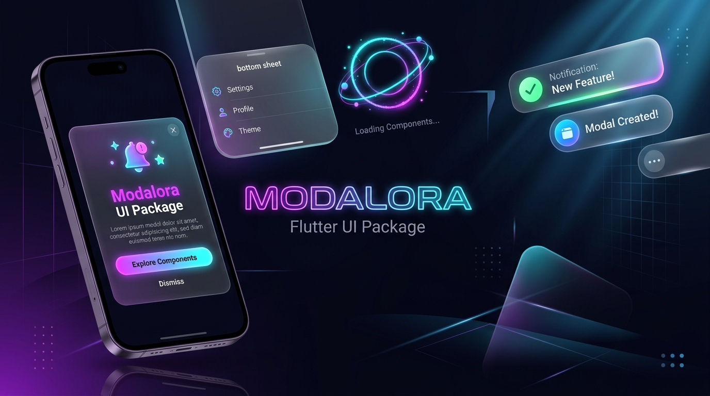

# ✨ Modalora — The Ultimate Flutter Overlay Experience System

<p align="center">
  
</p>

<p align="center">
  <a href="https://pub.dev/packages/modalora"></a>
  <a href="https://imcoderaditya.github.io/Modalora/"></a>
  <a href="https://github.com/imCoderAditya/Modalora"></a>
  <a href="https://flutter.dev"></a>
  <a href="https://flutter.dev"></a>
  <a href="https://github.com/imCoderAditya/Modalora"></a>
</p>

---

> 🌐 **Interactive Documentation Website & Live Simulator**:
> Explore live component previews, interactive phone simulator, code generators, and full API documentation at:
> 👉 **[imcoderaditya.github.io/Modalora](https://imcoderaditya.github.io/Modalora/)**

---

> **“Beautiful by default. Completely customizable by choice.”**

**Modalora** is a high-performance, developer-first **Flutter Overlay Experience System** providing a unified, reactive architecture for **Dialogs, Bottom & Top Sheets, Popups, Context Menus, Toast Snackbars, Orbital Loaders, and Spatial 3D Tilt Cards** with zero external dependencies.

---

## 📑 Table of Contents

- [🌐 Interactive Documentation Website](https://imcoderaditya.github.io/Modalora/)
- [🌟 Why Modalora?](#-why-modalora)
- [📦 Installation](#-installation)
- [🚀 Quick Start & Contextless Setup](#-quick-start--contextless-setup)
- [🎨 4-Tier Theme Cascade](#-4-tier-theme-cascade)
- [🛠️ Deep-Dive Feature Showcase](#️-deep-dive-feature-showcase)
  - [1. Glassmorphic Modal Dialogs](#1-glassmorphic-modal-dialogs)
  - [2. Flexible Bottom & Top Sheets](#2-flexible-bottom--top-sheets)
  - [3. iOS-Style Action Sheets](#3-ios-style-action-sheets)
  - [4. Collision-Aware Anchor Popups](#4-collision-aware-anchor-popups)
  - [5. Desktop Right-Click & Mobile Context Menus](#5-desktop-right-click--mobile-context-menus)
  - [6. Multi-Position Toast Snackbars](#6-multi-position-toast-snackbars)
  - [7. Orbital Loading & Blocker Overlays](#7-orbital-loading--blocker-overlays)
  - [8. 🌌 3D Hologram & Spatial Tilt Engine](#8--3d-hologram--spatial-tilt-engine)
  - [9. Adaptive Mobile / Desktop Breakpoint Routing](#9-adaptive-mobile--desktop-breakpoint-routing)
- [📱 Complete 7-Point `main.dart` Example](#-complete-7-point-maindart-example)
- [📊 API Quick Reference Table](#-api-quick-reference-table)
- [🧪 Testing & Quality](#-testing--quality)
- [📄 License & Community](#-license--community)

---

## 🌟 Why Modalora?

| Feature | Standard Flutter Modals | Modalora System |
| :--- | :--- | :--- |
| **Unified One-Liner API** | ❌ Fragmented (`showDialog`, `showModalBottomSheet`, etc.) | ✅ `Modalora.*` unified facade for all overlay types |
| **Frosted Glassmorphism** | ❌ Manual `BackdropFilter` wrapping | ✅ Apple-grade `surfaceBlur` & `barrierBlur` out of the box |
| **Optional `BuildContext`** | ❌ Strict `context` requirement everywhere | ✅ **Contextless support** via `ModaloraConfig.navigatorKey` |
| **Top & Bottom Sheets** | ❌ Bottom sheet only | ✅ Full `alignment` control (`bottomCenter`, `topCenter`, `center`) |
| **Screen Collision Aware** | ❌ Manual layout coordinates calculation | ✅ **Smart 8-way auto-flip** popups against screen edges |
| **3D Perspective Matrix** | ❌ Complex custom transform math | ✅ Built-in **3D gyro tilt**, specular glare & glowing rings |
| **Multi-Position Toasts** | ❌ Bottom snackbar only | ✅ 8 screen positions, countdown timer bars, swipe-to-dismiss |
| **Theme Resolution** | ❌ Inconsistent overrides | ✅ Predictable **4-Tier Property Priority Cascade** |
| **External Dependencies** | ⚠️ Often requires multiple 3rd party packages | ✅ **Zero dependencies** (100% pure Flutter SDK) |

---

## 📦 Installation

Add `modalora` to your `pubspec.yaml`:

```yaml
dependencies:
  modalora: ^1.0.0
```

Run in terminal:

```bash
flutter pub get
```

Import in your Dart code:

```dart
import 'package:modalora/modalora.dart';
```

---

## 🚀 Quick Start & Contextless Setup

### 1. Global Setup (Enables Contextless Calls)

Configure `Modalora` once in your `main()` function:

```dart
import 'package:flutter/material.dart';
import 'package:modalora/modalora.dart';

final GlobalKey<NavigatorState> navigatorKey = GlobalKey<NavigatorState>();

void main() {
  Modalora.configure(
    navigatorKey: navigatorKey,
    theme: ModaloraThemeData.dark(
      primaryColor: const Color(0xFF6366F1),
    ),
  );
  runApp(const MyApp());
}

class MyApp extends StatelessWidget {
  const MyApp({super.key});

  @override
  Widget build(BuildContext context) {
    return MaterialApp(
      navigatorKey: navigatorKey, // Required for contextless mode
      home: const HomeScreen(),
    );
  }
}
```

> **💡 Contextless Trigger:** With `ModaloraConfig.navigatorKey` registered, you can call `Modalora.dialog(...)`, `Modalora.snackbar(...)`, `Modalora.hologram(...)`, or `Modalora.loading(...)` from anywhere — including BLoC, Riverpod, Providers, or background services without needing a `BuildContext`!

---

## 🎨 4-Tier Theme Cascade

Modalora guarantees predictable design token inheritance using a strict 4-tier cascade:

```text
┌─────────────────────────────────────────────────────────────┐
│ 1. Individual Inline Property (Highest Priority)            │
│    e.g. Modalora.dialog(surfaceBlur: 24.0, title: '...')    │
├─────────────────────────────────────────────────────────────┤
│ 2. Component Theme                                          │
│    e.g. ModaloraThemeData(dialogTheme: ModaloraDialogTheme) │
├─────────────────────────────────────────────────────────────┤
│ 3. Ambient / Global Theme                                   │
│    e.g. ModaloraConfig.theme = ModaloraThemeData.dark()     │
├─────────────────────────────────────────────────────────────┤
│ 4. System Default Fallback (Lowest Priority)                │
└─────────────────────────────────────────────────────────────┘
```

---

## 🛠️ Deep-Dive Feature Showcase

### 1. Glassmorphic Modal Dialogs

```dart
// 1-Line simple dialog
Modalora.dialog(
  title: 'Project Initialized',
  message: 'Your repository is now connected and synced.',
);

// Advanced dialog with spring physics, header icon, and custom actions
Modalora.dialog(
  title: 'Delete Repository?',
  message: 'This operation is permanent and cannot be reversed.',
  icon: const Icon(Icons.delete_outline_rounded),
  surfaceBlur: 16.0,
  barrierBlur: 12.0,
  animation: ModaloraAnimation.spring(),
  primaryActionText: 'Keep File',
  destructiveActionText: 'Delete Permanently',
  onDestructiveAction: () {
    print('Item deleted');
  },
  autoCloseDuration: const Duration(seconds: 10), // Optional circular countdown
);
```

---

### 2. Flexible Bottom & Top Sheets

Modalora gives you complete freedom over sheet placement with `alignment`:

```dart
// Traditional Drag-to-Dismiss Bottom Sheet
Modalora.bottomSheet(
  alignment: Alignment.bottomCenter,
  title: 'Filter Products',
  showDragHandle: true,
  snapPoints: const [0.4, 0.85],
  child: const MyFilterWidget(),
);

// Modern Top Sheet Command Bar
Modalora.bottomSheet(
  alignment: Alignment.topCenter,
  title: 'Quick Command Palette',
  child: const MySearchWidget(),
);
```

---

### 3. iOS-Style Action Sheets

```dart
Modalora.actionSheet(
  title: 'Select Destination',
  message: 'Choose where you would like to export your report.',
  actions: [
    ModaloraActionSheetItem(
      title: 'Save to Google Drive',
      icon: Icons.cloud_upload_outlined,
      onTap: () => exportToDrive(),
    ),
    ModaloraActionSheetItem(
      title: 'Send via Email',
      icon: Icons.email_outlined,
      onTap: () => sendEmail(),
    ),
    ModaloraActionSheetItem(
      title: 'Discard Report',
      icon: Icons.delete_outline,
      isDestructive: true,
      onTap: () => discard(),
    ),
  ],
  cancelText: 'Dismiss',
);
```

---

### 4. Collision-Aware Anchor Popups

Attaches precisely to any widget key and automatically flips when reaching screen bounds:

```dart
final GlobalKey buttonKey = GlobalKey();

ElevatedButton(
  key: buttonKey,
  onPressed: () {
    Modalora.popup(
      anchorKey: buttonKey,
      anchor: ModaloraPopupAnchor.bottom, // Auto-flips to top if near screen bottom!
      title: 'Helpful Tip',
      message: 'This action will instantly publish your post.',
      offset: const Offset(0, 8.0),
    );
  },
  child: const Text('Publish'),
);
```

---

### 5. Desktop Right-Click & Mobile Context Menus

```dart
// Wrap any widget for Desktop Right-Click & Mobile Long-Press
ModaloraContextMenuRegion(
  items: [
    ModaloraMenuItem(
      title: 'Copy URL',
      icon: Icons.copy_rounded,
      shortcut: '⌘C',
      onSelected: () => copyUrl(),
    ),
    ModaloraMenuItem(
      title: 'Share...',
      icon: Icons.share_outlined,
      onSelected: () => share(),
    ),
    const ModaloraMenuDivider(),
    ModaloraMenuItem(
      title: 'Delete',
      icon: Icons.delete_outline_rounded,
      isDestructive: true,
      onSelected: () => delete(),
    ),
  ],
  child: Container(
    padding: const EdgeInsets.all(20),
    child: const Text('Right-click (or long press) me!'),
  ),
);
```

---

### 6. Multi-Position Toast Snackbars

```dart
// Multi-position toast with live timer progress bar
Modalora.snackbar(
  title: 'Changes Saved',
  message: 'All files synchronized to the cloud.',
  position: ModaloraPosition.topCenter, // topCenter, bottomCenter, topRight, etc.
  duration: const Duration(seconds: 4),
  showProgressBar: true,
  dismissOnSwipe: true,
  actionLabel: 'UNDO',
  onActionPressed: () => undoChanges(),
);
```

---

### 7. Orbital Loading & Blocker Overlays

```dart
// Launch loading spinner and obtain token handle
final handle = Modalora.loading(
  title: 'Processing Payment...',
  message: 'Please do not close this window.',
);

// Execute asynchronous operation
await processOrder();

// Dismiss programmatically
await handle.dismiss();
```

---

### 8. 🌌 3D Hologram & Spatial Tilt Engine

Transform your modals into next-generation 3D spatial experiences with real-time pointer/gyro tilt, pulsing glowing orbital rings, and specular light reflections:

```dart
// 1. One-Line 3D Hologram Dialog
await Modalora.hologram(
  title: '3D Hologram Engine',
  message: 'Real-time Matrix4 3D perspective gyro tilting and specular light sheen.',
  icon: Icons.view_in_ar_rounded,
  accentColor: const Color(0xFF06B6D4),        // Glowing Cyan
  secondaryAccentColor: const Color(0xFF8B5CF6), // Ambient Purple
  primaryActionText: 'Explore 3D',
  secondaryActionText: 'Dismiss',
  features: const [
    Modalora3DFeature(icon: Icons.threed_rotation_rounded, label: '3D Tilt'),
    Modalora3DFeature(icon: Icons.flare_rounded, label: 'Specular Glare'),
    Modalora3DFeature(icon: Icons.blur_on_rounded, label: 'Frosted Glass'),
  ],
  onPrimaryAction: () {
    print('3D Action Tapped!');
  },
);

// 2. Wrap ANY custom widget into a 3D Perspective Modal
await Modalora.dialog3D(
  maxTilt: 0.3,
  perspective: 0.002,
  child: MyCustomGlassCard(),
);

// 3. Reusable 3D Tilt Card on any screen
Modalora3DTiltCard(
  maxTilt: 0.25,
  glareIntensity: 0.4,
  child: MyProfileWidget(),
);
```

---

### 9. Adaptive Mobile / Desktop Breakpoint Routing

```dart
Modalora.adaptive(
  title: 'User Profile',
  breakpoint: 768.0, // Renders BottomSheet on mobile (<768px), Dialog on desktop (≥768px)
  child: const ProfileSettingsForm(),
);
```

---

## 📱 Complete 7-Point `main.dart` Example

Copy and paste this complete, self-contained starter application directly into your project:

```dart
import 'package:flutter/material.dart';
import 'package:modalora/modalora.dart';

final GlobalKey<NavigatorState> navigatorKey = GlobalKey<NavigatorState>();

void main() {
  Modalora.configure(
    navigatorKey: navigatorKey,
    theme: ModaloraThemeData.dark(
      primaryColor: const Color(0xFF6366F1),
    ),
  );
  runApp(const ModaloraShowcaseApp());
}

class ModaloraShowcaseApp extends StatelessWidget {
  const ModaloraShowcaseApp({super.key});

  @override
  Widget build(BuildContext context) {
    return MaterialApp(
      navigatorKey: navigatorKey,
      debugShowCheckedModeBanner: false,
      theme: ThemeData.dark(useMaterial3: true),
      home: const HomeScreen(),
    );
  }
}

class HomeScreen extends StatelessWidget {
  const HomeScreen({super.key});

  @override
  Widget build(BuildContext context) {
    final GlobalKey popupKey = GlobalKey();

    return Scaffold(
      appBar: AppBar(
        title: const Text('✨ Modalora Showcase'),
        centerTitle: true,
      ),
      body: Center(
        child: SingleChildScrollView(
          padding: const EdgeInsets.all(24.0),
          child: Column(
            mainAxisAlignment: MainAxisAlignment.center,
            children: [
              // 1. Glass Dialog Demo
              ElevatedButton.icon(
                icon: const Icon(Icons.chat_bubble_outline_rounded),
                label: const Text('1. Show Dialog'),
                onPressed: () {
                  Modalora.dialog(
                    title: 'Delete Document?',
                    message: 'Are you sure you want to permanently remove this file?',
                    primaryActionText: 'Keep File',
                    destructiveActionText: 'Delete',
                  );
                },
              ),
              const SizedBox(height: 14),

              // 2. Bottom Sheet Demo (Alignment.bottomCenter)
              ElevatedButton.icon(
                icon: const Icon(Icons.vertical_align_bottom_rounded),
                label: const Text('2. Open Bottom Sheet'),
                onPressed: () {
                  Modalora.bottomSheet(
                    alignment: Alignment.bottomCenter,
                    title: 'Bottom Sheet Filter',
                    showDragHandle: true,
                    child: const Padding(
                      padding: EdgeInsets.symmetric(vertical: 16.0),
                      child: Text('Smooth drag gesture with bottomCenter alignment.'),
                    ),
                  );
                },
              ),
              const SizedBox(height: 14),

              // 3. Top Sheet Demo (Alignment.topCenter)
              ElevatedButton.icon(
                icon: const Icon(Icons.vertical_align_top_rounded),
                label: const Text('3. Open Top Sheet'),
                onPressed: () {
                  Modalora.bottomSheet(
                    alignment: Alignment.topCenter,
                    title: 'Top Sheet Command Bar',
                    child: const Padding(
                      padding: EdgeInsets.all(16.0),
                      child: Text('Enters seamlessly from the top edge!'),
                    ),
                  );
                },
              ),
              const SizedBox(height: 14),

              // 4. Anchor-Targeted Popup
              ElevatedButton.icon(
                key: popupKey,
                icon: const Icon(Icons.ads_click_rounded),
                label: const Text('4. Anchor Popup'),
                onPressed: () {
                  Modalora.popup(
                    anchorKey: popupKey,
                    anchor: ModaloraPopupAnchor.bottom,
                    title: 'Smart Tip',
                    message: 'Automatically flips if colliding with screen bottom!',
                  );
                },
              ),
              const SizedBox(height: 14),

              // 5. Toast Snackbar with Countdown
              ElevatedButton.icon(
                icon: const Icon(Icons.notifications_active_outlined),
                label: const Text('5. Trigger Toast'),
                onPressed: () {
                  Modalora.snackbar(
                    title: 'Project Saved',
                    message: 'All changes synchronized to cloud.',
                    showProgressBar: true,
                    position: ModaloraPosition.bottomCenter,
                  );
                },
              ),
              const SizedBox(height: 14),

              // 6. Orbital Loading Overlay with Handle Dismiss
              ElevatedButton.icon(
                icon: const Icon(Icons.hourglass_top_rounded),
                label: const Text('6. Orbital Loader'),
                onPressed: () async {
                  final handle = Modalora.loading(
                    title: 'Syncing Database...',
                    message: 'Please wait a moment.',
                  );

                  await Future.delayed(const Duration(milliseconds: 2500));
                  await handle.dismiss();

                  Modalora.snackbar(
                    title: 'Completed!',
                    message: 'Database synced successfully.',
                  );
                },
              ),
              const SizedBox(height: 14),

              // 7. 3D Hologram Tilt Modal (Direct 1-line package call)
              ElevatedButton.icon(
                icon: const Icon(Icons.view_in_ar_rounded),
                label: const Text('7. 3D Hologram Modal'),
                style: ElevatedButton.styleFrom(
                  backgroundColor: const Color(0xFF06B6D4),
                  foregroundColor: Colors.white,
                ),
                onPressed: () {
                  Modalora.hologram(
                    title: '3D Hologram Engine',
                    message: 'Real-time 3D perspective gyro tilting and specular light reflections.',
                    primaryActionText: 'Explore 3D',
                    secondaryActionText: 'Dismiss',
                  );
                },
              ),
            ],
          ),
        ),
      ),
    );
  }
}
```

---

## 📊 API Quick Reference Table

| Category | Parameter | Type | Default | Description |
| :--- | :--- | :--- | :--- | :--- |
| **Common** | `context` | `BuildContext?` | `null` | Automatically resolves `ModaloraConfig.navigatorKey` |
| **Common** | `title` | `String?` | `null` | Primary headline title text |
| **Common** | `message` | `String?` | `null` | Secondary description body text |
| **Common** | `surfaceBlur` | `double?` | `16.0` | Apple-grade frosted glass container blur sigma |
| **Common** | `barrierBlur` | `double?` | `10.0` | Backdrop screen blur sigma |
| **Common** | `animation` | `ModaloraAnimation?` | `fadeScale` | Custom spring/fade/slide animation physics |
| **BottomSheet** | `alignment` | `AlignmentGeometry?` | `bottomCenter` | Alignment (`bottomCenter`, `topCenter`, `center`) |
| **BottomSheet** | `showDragHandle`| `bool?` | `true` | Displays top rounded drag pill indicator |
| **BottomSheet** | `snapPoints` | `List<double>?` | `null` | Multi-stage fractional heights (e.g. `[0.4, 0.85]`) |
| **Dialog** | `autoCloseDuration` | `Duration?` | `null` | Auto-dismisses modal with circular timer bar |
| **Popup** | `anchorKey` | `GlobalKey?` | `null` | GlobalKey of the target element to anchor to |
| **Popup** | `anchor` | `ModaloraPopupAnchor` | `bottom` | Directional anchor with automatic screen collision flip |
| **Menu** | `items` | `List<ModaloraMenuEntry>`| `required` | Menu entries with keyboard shortcuts & submenus |
| **Snackbar** | `position` | `ModaloraPosition` | `bottomCenter`| 8 screen coordinate placements with queue stacking |
| **Snackbar** | `showProgressBar` | `bool?` | `false` | Animated linear countdown timer line |
| **Loading** | `returns` | `ModaloraOverlayHandle` | `handle` | Token handle with `await handle.dismiss()` |
| **3D Hologram** | `accentColor` | `Color` | `0xFF06B6D4` | Primary glowing orbital ring & specular highlight |
| **3D Hologram** | `maxTilt` | `double` | `0.25` | Angular 3D perspective tilt magnitude on pointer drag |
| **3D Hologram** | `glareIntensity` | `double` | `0.35` | Specular radial light sheen opacity |

---

## 🧪 Testing & Quality

Every single release is validated against 100% automated test coverage and strict static analysis:

```bash
# Run unit & widget test suites
flutter test

# Run strict Flutter analyzer
flutter analyze
```

---

## 📄 License & Community

```text
MIT License

Copyright (c) 2026 Modalora Authors

Permission is hereby granted, free of charge, to any person obtaining a copy
of this software and associated documentation files (the "Software"), to deal
in the Software without restriction, including without limitation the rights
to use, copy, modify, merge, publish, distribute, sublicense, and/or sell
copies of the Software, and to permit persons to whom the Software is
furnished to do so, subject to the following conditions:

The above copyright notice and this permission notice shall be included in all
copies or substantial portions of the Software.

THE SOFTWARE IS PROVIDED "AS IS", WITHOUT WARRANTY OF ANY KIND, EXPRESS OR
IMPLIED, INCLUDING BUT NOT LIMITED TO THE WARRANTIES OF MERCHANTABILITY,
FITNESS FOR A PARTICULAR PURPOSE AND NONINFRINGEMENT. IN NO EVENT SHALL THE
AUTHORS OR COPYRIGHT HOLDERS BE LIABLE FOR ANY CLAIM, DAMAGES OR OTHER
LIABILITY, WHETHER IN AN ACTION OF CONTRACT, TORT OR OTHERWISE, ARISING FROM,
OUT OF OR IN CONNECTION WITH THE SOFTWARE OR THE USE OR OTHER DEALINGS IN THE
SOFTWARE.
```

- **Open Source**: Modalora is distributed under the [MIT License](LICENSE) — free for both commercial and personal use.
- **Contributions**: Contributions, bug reports, and feature ideas are warmly welcome on [GitHub](https://github.com/imCoderAditya/Modalora).
- **Author**: Built with ❤️ for the Flutter & Dart developer community.
